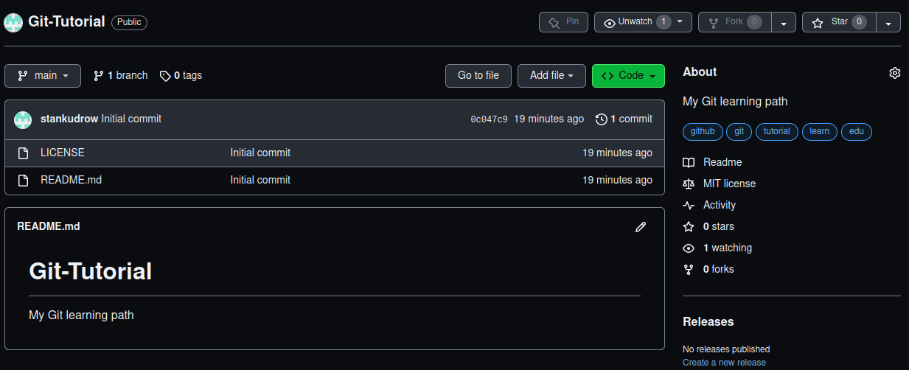
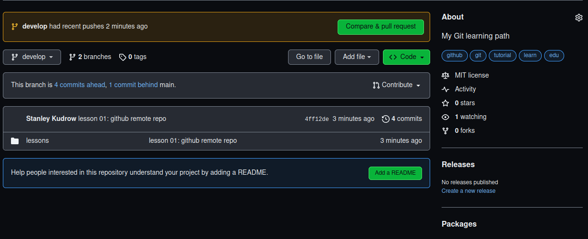

# Git Practice - remote repository

Before you go, consider reading the [README.md](../../README.md) file at the root of the project.

## Table of Contents

- [New branch](#new-branch)
- [Remote repository](#remote-repository)
- [Next tutorial](#next-tutorial)
- [References](#references)

### New branch

Since this note all the work will be done in a new `develop` branch.
The `main` branch wii be meant for releases and it is good to keep it clean.

First, available branches of this repository

```shell
╰─➤  git --no-pager branch --all
* main
```

The `--no-pager` option is for printing the output into the standard output stream (stdout) instead of pager program.
The `-a/--all` option is about all branches, including remote, but there are not any yet.

Now, creating a branch (`-c/--create`) and switching to it:

```shell
╰─➤  git switch --create develop
Switched to a new branch 'develop'
╭─<...> ~/Projects/git-tutorial  ‹develop*› 
```

Checking (the asterisk/star show the current branch we are at):

```shell
╰─➤  git --no-pager branch
* develop
  main
```

These branches are still local, but I want this work to be pushed into the remote repository.

### Remote repository

Time to publish this work to my GitHub account.
To achieve this goal, `git remote add <name> <url>` is helpful. It needs:

- \<url\> - the URL of a remote repository

- \<name\> - a shortcut (label) for the specified URL

This command will modify `.git/config` file for you with necessary references (the contents will be listed later).

To send data to the remote repository - `git push` command.

Steps to take:

1. `git remote origin git@github.com:stankudrow/Git-Tutorial.git` (the name of the repository will be `Git Tutorial`, GitHub replaces spaces with hyphens).

    Changes in the `.git/config` file:

    ```shell
    ╰─➤  cat .git/config 
    [core]
        repositoryformatversion = 0
        filemode = true
        bare = false
        logallrefupdates = true
    [remote "origin"]
        url = git@github.com:stankudrow/Git-Tutorial.git
        fetch = +refs/heads/*:refs/remotes/origin/*
    ```

2. `git add lessons/01_remote_repo.md`

3. `git commit -m "lesson 01: remote repository note"`

4. `git push` - failed

    ```shell
    ╰─➤  git push
    fatal: The current branch develop has no upstream branch.
    To push the current branch and set the remote as upstream, use

        git push --set-upstream origin develop
    ```

    Upstream means the relationship from local to remote.
    The inverse order is downstream.

5. aight, repeating the steps 2 and 3 + `git push --set-upstream origin develop`

    ```shell
    ╰─➤  git status -s
    M lessons/00_introduction.md
    M lessons/01_remote_repo.md
    ?? README.md
    ╭─<...> ~/Projects/git-tutorial  ‹develop*› 
    ╰─➤  git add lessons/01_remote_repo.md
    ╭─<...> ~/Projects/git-tutorial  ‹develop*› 
    ╰─➤  git status -s
    M lessons/00_introduction.md
    M  lessons/01_remote_repo.md
    ?? README.md
    ╭─<...> ~/Projects/git-tutorial  ‹develop*› 
    ╰─➤  git commit -m "push origin develop"
    [develop 9659d20] push origin develop
    1 file changed, 13 insertions(+), 44 deletions(-)
    ╭─<...> ~/Projects/git-tutorial  ‹develop*› 
    ╰─➤  git push --set-upstream origin develop
    ERROR: Repository not found.
    fatal: Could not read from remote repository.
    
    Please make sure you have the correct access rights
    and the repository exists.
    ```

6. Damn, the correct access is, but I forgot to create the repository. Now I need to create `Git Tutorial` repository, so GitHib will convert it into `Git-Tutorial`, so the references from `.git/config` won't get invalid.

    

7. I understood that the project needs a bit of restructure: the lessons/notes are moved into the corresponding directories.

    ```shell
    ╰─➤  git status
    On branch develop
    Changes not staged for commit:
    (use "git add/rm <file>..." to update what will be committed)
    (use "git restore <file>..." to discard changes in working directory)
            deleted:    lessons/00_introduction.md
            deleted:    lessons/01_remote_repo.md

    Untracked files:
    (use "git add <file>..." to include in what will be committed)
            README.md
            lessons/00/
            lessons/01/

    no changes added to commit (use "git add" and/or "git commit -a")
    ```

    `git add lessons` will handle the deleted files as well

    ```shell
    ╰─➤  git add lessons
    ╭─<...> ~/Projects/git-tutorial  ‹develop*› 
    ╰─➤  git status
    On branch develop
    Changes to be committed:
    (use "git restore --staged <file>..." to unstage)
            renamed:    lessons/00_introduction.md -> lessons/00/00_introduction.md
            renamed:    lessons/01_remote_repo.md -> lessons/01/01_remote_repo.md
            new file:   lessons/01/git-tutorial-github-repo.png

    Untracked files:
    (use "git add <file>..." to include in what will be committed)
            README.md
    ```

    ```shell
    ╰─➤  git commit -m "lesson 01: github remote repo"
    [develop 4ff12de] lesson 01: github remote repo
    3 files changed, 95 insertions(+), 39 deletions(-)
    rename lessons/{ => 00}/00_introduction.md (84%)
    rename lessons/{ => 01}/01_remote_repo.md (63%)
    create mode 100644 lessons/01/git-tutorial-github-repo.png
    ╰─➤  git push --set-upstream origin develop
    Enumerating objects: 20, done.
    Counting objects: 100% (20/20), done.
    Delta compression using up to 16 threads
    Compressing objects: 100% (14/14), done.
    Writing objects: 100% (20/20), 76.03 KiB | 19.01 MiB/s, done.
    Total 20 (delta 4), reused 0 (delta 0), pack-reused 0
    remote: Resolving deltas: 100% (4/4), done.
    remote: 
    remote: Create a pull request for 'develop' on GitHub by visiting:
    remote:      https://github.com/stankudrow/Git-Tutorial/pull/new/develop
    remote: 
    To github.com:stankudrow/Git-Tutorial.git
    * [new branch]      develop -> develop
    Branch 'develop' set up to track remote branch 'develop' from 'origin'.
    ```

Yay, it is done, this is fine, the changes are applied:



**Update**:

- all tutorial notes are added into the `develop` branch. It is good for future possible merge conflicts to be resolved.

- I can use just `git push` command because the upstream was set before.

### Next tutorial

- `git log` - the history of a git project

- `git diff` - reading and understanding "interstate" differences

Git internals are still not covered because for now I am sticking to an intuitive approach. Certainly the theory must be exposed, but I believe the time has not come yet as long as we are okay with practice-oriented way. If not, consider picking up the theory on your own starting now or even earlier.

### References

- [Atlassian: Git Remote](https://www.atlassian.com/git/tutorials/syncing)

- [Git docs: git-remote](https://git-scm.com/docs/git-remote)

- [Stack Overflow: git-push-fatal-no-configured-push-destination](https://stackoverflow.com/questions/10032964/git-push-fatal-no-configured-push-destination)

- [GitHub docs: Create a Repo](https://docs.github.com/en/get-started/quickstart/create-a-repo)

- [Stack Overflow: what-is-origin-in-git](https://stackoverflow.com/questions/9529497/what-is-origin-in-git)

- [GitHub: adding-a-local-repository-to-github-using-git](https://docs.github.com/en/migrations/importing-source-code/using-the-command-line-to-import-source-code/adding-locally-hosted-code-to-github#adding-a-local-repository-to-github-using-git)
